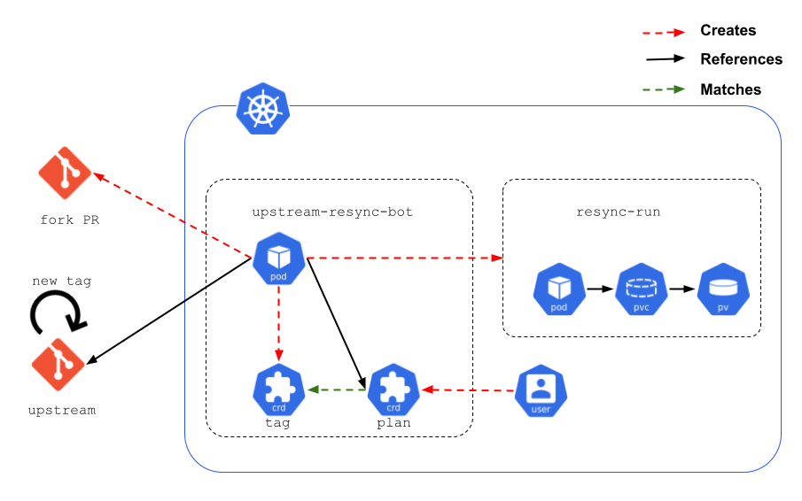

# Upstream Repository Resync Enhancement Proposal

## Motivation

Many Openshift teams frequently spend time synchronizing downstream projects with their upstreams.
Each team has a different way of dealing with this activity, and there is an opportunity to provide a generic and semi- or fully-automated answer to this issue through Openshift CI.

## Proposal

Opinionated, yet configurable bot, that can follow resync plans and interact with owners via Github Pull Requests. 

There are existing solutions within Openshift, each written to accomodate one team's approach. These typically include hard-coded steps, such as running `git` or `go mod` commands.
* [merge-bot](https://github.com/shiftstack/merge-bot/blob/main/src/merge_bot/merge_bot.py#L135)
* [rebase-bot](https://github.com/openshift-cloud-team/rebasebot/blob/main/rebasebot/bot.py#L82)

This proposal describes how the hard-coded steps can be abstracted into a config file, thus single implementation can be leveraged by multiple teams.

### What this proposal is not

* Teaching a program how to resolve conflicts between upstream and downstream repositories. 

## Use Cases

* Automate upstream repo re-sync process
* Track a GitHub repository releases ([public events](https://docs.github.com/en/rest/reference/activity#events), [release event](https://docs.github.com/en/developers/webhooks-and-events/events/github-event-types#releaseevent)) and automatically start syncing to downstream repository
* User interaction via PR comments on conflicts/errors


## Implementation

Teams handle resynchronization activities in many different ways, depending on the legacy of the project, on the types of changes that need to be imported to the downstream (patches, new versions, etc). 
It is therefore not possible to propose a single recipe for resyncrhonizing one repo with its upstream. 

Rather, this proposal is to allow the team to:
* watch for specific tags on the upstream repository,
* and to define the recipe (plan), with specific steps, that would match this resynchronization use case. 

Both of these elements (tags and plans) become Custom Resources that are used to run a resync-run in Openshift CI, which results in creating the Pull Request containing the resynchronization changes.



### Tag

Representation of a release inside an Openshift cluster.
When a new Tag comes in, it's put in an upgrade graph and matched against Plans. If no Plan for the Tag exists,
the Tag is left as it is. If a Plan exists, the Tag is considered for syncing based on it's priority in the upgrade graph.
The upgrade graph follows the principles of semantic versioning. Older Tags have higher priority.

Example:
```
kind: tag
metadata:
  name: 1.21.2
spec:
  repository: github.com/kubernetes/kubernetes
  next: 1.21.3
status:
  plan: z-release-4.8
  phase: finished
  pullRequest: github.com/openshift/kubernetes/pulls/13123
  conditions:
  - type: ResynchroPlanStatus
    status: finished
    reason: ""
    message: resynchro plan z-release-4.8 is finished
```

### Plan

The Plan Custom Resource mainly defines the steps that the CI will perform in order to prepare a PR resynchronizing the repository with its upstream for a certain tags. 

It contains 2 major sections: 
* config: defines, at minimum, the upstream tag, and the downstream branch as well as the container image that the plan will use
* steps: lists the steps that will run sequentially  during the plan execution

Example:
```
kind: plan
metadata:
  name: z-release-4.8
spec: 
  config:
  upstream:
    name: github.com/kubernetes/kubernetes
    matchedVersions:
    - 1.21.x
  downstream:
    name: github.com/openshift/kubernetes
    branch: release-4.8
  enablePrereleases: false
  image: registry.ci.openshift.org/openshift/release:rhel-8-release-golang-1.16-openshift-4.8
  env:
  - name: UPSTREAM_REF
    from: .config.upstream.name
  - name: DOWNSTREAM_REF
    from: .config.downstream.name
  - name: CHANGELOG_LINK
    value: https://github.com/kubernetes/kubernetes/blob/ster/CHANGELOG/CHANGELOG-1.21.md#1212
  slack:
    credentials:
    secretSelector: slack-secret
  github:
    credentials:
    secretSelector: github-secret
  steps:
  - name: Git merge
    run: git merge $UPSTREAM_REF
  - name: Update go.mod
    run: 'sed -E "/=>/! s/(\tgithub.com\/openshift\/[a-z|-]+) (.*)$/\1 $DOWNSTREAM_REF/" go.mod'
  - name: Go mod tidy
    run: go mod tidy
  - name: Update vendor
    run: hack/update-vendor.sh
  - name: Update hyperkube Dockerfile
    run: 'sed -E "s/(io.openshift.build.versions=\"kubernetes=)(1.[1-9]+.[1-9]+)/\1$k8s_tag/" openshift-hack/images/hyperkube/Dockerfile.rhel'
  - name: Re-generate files
    run: make update OS_RUN_WITHOUT_DOCKER=yes
  - name: Git add
    run: git add -A
  - name: Git commit
    run:  'git commit -m "UPSTREAM: <drop>: hack/update-vendor.sh, make update and update image"'
  - name: Create PR
    action:
      type: pull-request
      title: "Bug $BUGZILLA_ID: Rebase $UPSTREAM_REF"
      body: "Changelog: $CHANGELOG_LINK"
  - name:
    action:
      type: slack-notification
      channel: chan-1
      message: "New version!"
```


#### Authentication

The bot authenticates to Github with its own [Github App](https://docs.github.com/en/developers/apps/getting-started-with-apps/about-apps) credentials stored in a secret inside Openshift CI cluster.
The credentials carry neccessary permisions for the bot to:
* Create PRs
* Read&write PR comments

This proposal assumes the bot has access only to public APIs of the upstream repository.
